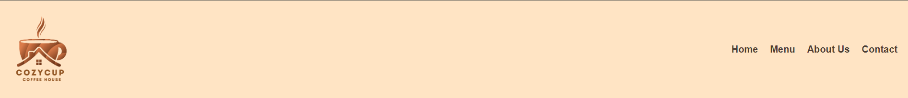
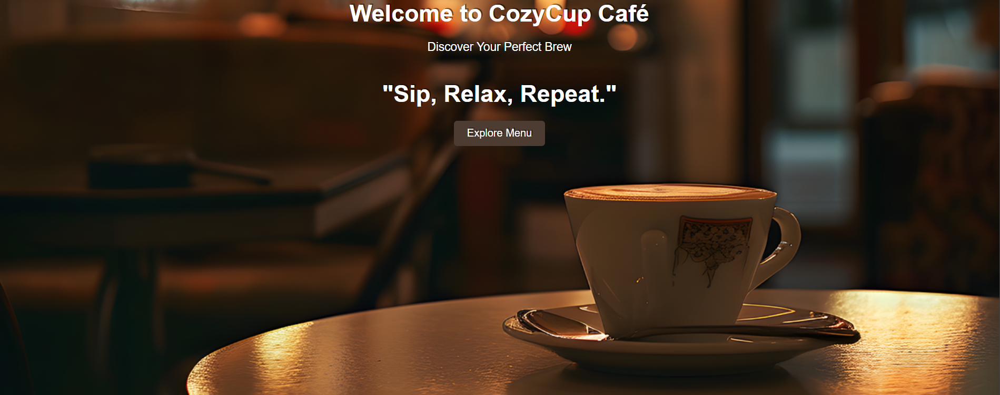
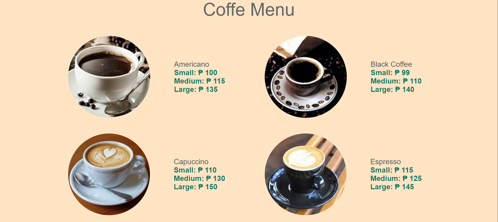
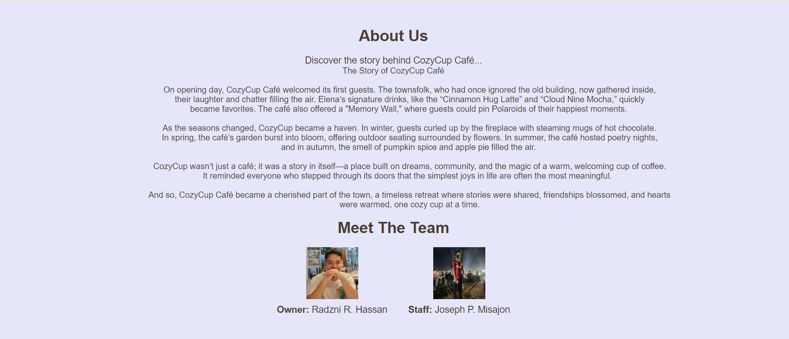

# Project Description
This project is a simple website design and fix featuring a colaboration between partners  
(had to invite another acc because i cant push unless he's a collaborator but he had no contribution all acc exept joseph is me). 😅

# Features 
* This website features a welcoming home page
* Lots of items on the menu
* An engaging story about how the cafe came to be
* An interactive socmed logo u can click

# Screen Capture

This is our navigation section featuring navigation for the site

And this is the Home section featuring tagline and a welcoming photo

Next is the Menu section that features all the products of the cafe

This is the about section features the story of the cafe and the members

This is the contact and footer section features app costumer can contact the cafe

# About Authors

<b>Name: </b> Radzni R. Hassan  

<b>Email: </b> 202280084@psu.palawan.edu.ph

 

<b>Name: </b> Joseph P. Misajon 

<b>Email: </b> 202280387@psu.palawan.edu.ph

